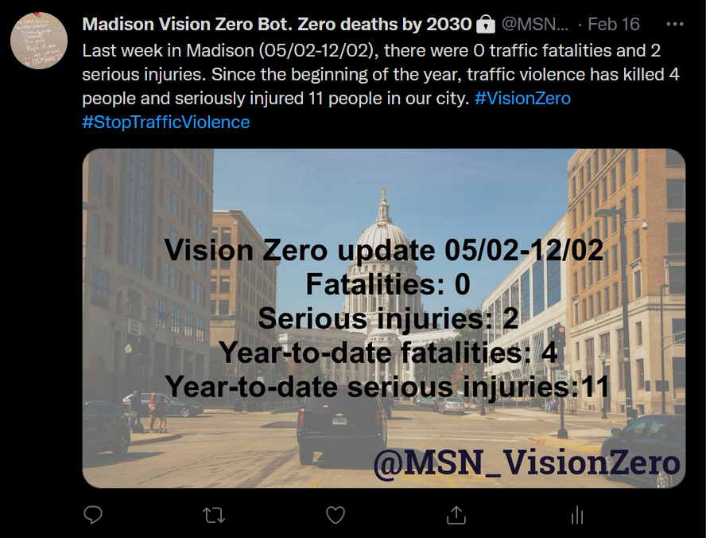

```{r setup, include=FALSE}
knitr::opts_chunk$set(echo = T, eval = F)
```

I'm a big fan of Twitter bots. Accounts like EveryLot. And of course I myself run the content end of the Cyclists_of_MSN bot. I had ideas for other Twitter bots but lacked the technical skills to make them happen. So when I recently saw an article documenting how to create a Twitter bot by combining an R script with GitHub Actions, I was intrigued and got coding. The goal: A [Twitter account](https://twitter.com/MSN_VisionZero) automatically posting content related to [Vision Zero in Madison](https://www.cityofmadison.com/transportation/initiatives/vision-zero), a policy and action plan that strives to eliminate all traffic fatalities and injuries in our city by 2030.

")

I want to document that process here, focusing on things not described in other tutorials and helping others to set up their own Vision Zero bots. In general, I recommend following [Matt Dray's guide](https://www.rostrum.blog/2020/09/21/londonmapbot/). Note his most recent update about needing to apply for elevated access for your Twitter development account!

## Crash data

Data about traffic crashes in Wisconsin is reported by police and collected and processed by the UW-Madison Traffic Operations and Safety Lab. A user-friendly interactive way to access the data is through the [Community Maps portal](https://transportal.cee.wisc.edu/partners/community-maps/crash/search/BasicSearch.do). The web interface has no obvious option to download the underlying data, but I recently realized that there is indeed an API available, documented [here](http://transportal.cee.wisc.edu/partners/community-maps/docs/CM_Data_Service_User_Guide_202202.pdf)[^1]. First, we download a `json` file with the crash data for the whole county:

[^1]: This link may break in the future. In that case go to <https://transportal.cee.wisc.edu/partners/community-maps/crash/pages/help.jsp> and click the link to the "Community Maps JSON/KMZ Data Service User Guide."

```{r}
download.file("https://CommunityMaps.wi.gov/crash/public/crashesKML.do?filetype=json&startyear=2022&injsvr=K&injsvr=A&county=dane", "crashes.json")
```

The parameters for the query are mostly obvious: `startyear`, `filetype`, and `county`. Less obvious is the `injsvr` parameters: The severity of crashes is classified into five classes:

-   K: Fatality

-   A: Suspected Serious Injury

-   B: Suspected Minor Injury

-   O: No apparent Injury

So our query retrieves: a GeoJSON file of crashes flagged as fatal or resulting in serious injury[^2] that occurred in Dane County in 2022.

[^2]: Note that the severity classification is mostly based on the initial police report. It does appear that crashes to get re-classified when a victim passes away at a later point.

We then read in the file with the `sf` package:

```{r}
df <- st_read("crashes.json")
glimpse(df)
```

We do a little bit of data cleaning and also drop the geometry data -- for now, we're not using the geocoded crash locations for anything. Now is also a good time to filter the data to crashes that occurred in the City of Madison.

```{r}
crashes <- df %>%
  mutate(date = mdy(date),
         totfatl = as.numeric(totfatl),
         totinj = as.numeric(totinj)) %>%
  st_drop_geometry() %>% 
  filter(muniname == "MADISON")
```

Each row in the data represents one crash -- keep that in mind when producing summary data: One crash can lead to multiple injuries or fatalities.

One thing that still needs fixing is the `flags` variable. This is where each crash is [coded for factors](http://transportal.cee.wisc.edu/partners/community-maps/docs/CM_Crash_Flags_202106.pdf) like driver impairment, whether speeding was involved, or if the crash involved a pedestrian or cyclists---or a deer. The problem is that the data is not well formatted. I'm not sure if this is a problem with `sf` reading the JSON file or something wrong with the JSON file itself. To fix this, we re-read the JSON file with the `jsonlite` package and append the respective columns to our file.

```{r}
crashesJSON <- fromJSON("crashes.json")
crashes <- crashes %>%
  add_column(crashesJSON$features$properties)
```

## Setting up dates

One challenge I encountered was around setting up time intervals. I don't know how frequently the data in Community Maps are being updated, but from comparing the data with news reports of crashes, it seems like generally data make it into the portal fairly quickly. Based on that and the overall frequency of deadly and serious crashes, I decided to calculate summary statistics weekly for the preceding week. That makes for a good compromise between timeliness and accuracy.

Implementing this took me some thinking and testing with the `lubridate` package. First, we set a variable for today:

```{r}
d <- today()
```

Next, we need to define an interval for last week:

```{r}
last_week <- interval(start = floor_date(d, unit = "week")-8, end = floor_date(d, unit = "week")-1)
```

The way to do that is by using the rounding functions from `lubridate`. We round down from today's date to the nearest week. And then we subtract 8 days to get the beginning of the previous week, and 1 day to get the end of the previous week. It's possible there is a more elegant way to do this, but this works.

Finally, we create a nicely formatted string for the interval:

```{r}
last_week_formatted <- paste0(format(last_week@start, "%d/%m"),
                         "-",
                         format(floor_date(d, unit = "week")-1, "%d/%m"))
```

So this will produce something like "05/02-12/02", which we'll use for the content of the tweet.

Next, we set up a number of summary variables that will be used for composing the tweet: The weekly and annual number of crashes and of fatalities/serious injuries resulting from those crashes. `Lubridate`'s `%within%` operator makes for easy temporal filtering.

```{r}
crashes_wk <- crashes %>%
  filter(date %within% last_week)

#weekly numbers
tot_crashes_wk <- crashes_wk %>% nrow()
tot_fat_wk <- crashes_wk %>%
  summarise(sum(totfatl)) %>%
  pull()
tot_inj_wk <- crashes_wk %>%
  summarise(sum(totinj)) %>%
  pull()

# annual numbers
tot_crashes_yr <- crashes %>% nrow()
tot_fat_yr <- crashes %>%
  summarise(sum(totfatl)) %>%
  pull()
tot_inj_yr <- crashes %>%
  summarise(sum(totinj)) %>%
  pull()

```

## Composing the tweet

There are two pieces to the tweet. First we create the text of the tweet, using the variables we just created. Keep in mind Twitter's character limit when composing the text.

```{r}
tweet_1 <- paste0("Last week in Madison (",
                  last_week_formatted,
                  "), there were ",
                tot_fat_wk,
                " traffic fatalities and ",
                tot_inj_wk,
                " serious injury crashes. Since the beginning of the year, traffic violence has killed ",
                tot_fat_yr,
                " people and seriously injured ",
                tot_inj_yr,
                " people in our city. #VisionZero #StopTrafficViolence")
```

To make the tweet more visually interesting, we add an automatically generated image to it. This is easy with the `magick` package. We start with a public domain png image (cropped to Twitter's recommended aspect ratio and overlaid with a semi-transparent layer and our account's Twitter handle in GIMP).


```{r}
background <- image_read("madison_1200.png")
```

And then we use `image_annotate` to add the crash stats to it:

```{r}
image_text <- paste0("Vision Zero update ",
                     last_week_formatted,
                     "\n Fatalities: ",
                     tot_fat_wk,
                     "\n Serious injuries: ",
                     tot_inj_wk,
                     "\n Year-to-date fatalities: ",
                     tot_fat_yr,
                     "\n Year-to-date serious injuries:",
                     tot_inj_yr)

tweet_1_img <- image_annotate(background,
               image_text,
               size = 60,
               font = "sans",
               weight = 700, #bold text
               gravity = "center",
               color = "black")
```

Getting the text to fit the image in the right place and with the right size requires some experimenting with the parameters. Once finalized, we save the image as a file with `image_write`.

```{r}
image_write(tweet_1_img,
            path = "tweet_1_img.png")
```

Now all that remains to be done in R is to `post_tweet`:

```{r}
post_tweet(status = tweet_1,
           media = "tweet_1_img.png")
```

The result should look something like this:



# Automation with Github Actions

For setting up the automation of the bot, I again followed the instructions for the [London Map Bot](https://www.rostrum.blog/2020/09/21/londonmapbot/). Make sure you load all required packages as part of your `yaml` file.

A couple things that tripped me up in the process:

Storing the API credentials as Github Secrets. The Settings \> Secrets \> Actions page in our Github repository has two types of secrets, Environment Secrets and Repository Secrets. You need to set up your credentials as **Repository** Secrets. The second (more embarrassing) issue I encountered: Matching the names of the secrets between Github, your R script, and the Github Actions `yaml` file. There's a lot of copying and pasting, and the error messages from Github Actions aren't the most helpful. And so it took me way too long to realize that the failure of my bot to run was caused by mismatched variable names. One thing that helped with troubleshooting was the ability to manually trigger the Github Action with the [`workflow_dispatch`](https://github.blog/changelog/2020-07-06-github-actions-manual-triggers-with-workflow_dispatch/) option.

Once everything was working, we change the trigger to a `cron` job: Once a week, on Wednesdays at 17:33 UTC (i.e. 12:33 PM Central), the script will run an post the tweet.

```{r}
on:
  schedule:
    - cron: '33 17 * * Wed'
```

I have some ideas for additional features for the bot, such as a map of crashes or tweets triggered by the number of crashes crossing certain thresholds. But for now the bot is up and running. For anybody wanting to run a bot for their city or county in Wisconsin, the code is very easy to modify. Just head to the bot's [Github repository](https://github.com/vgXhc/vision_zero_bot/) and fork it! Feel free to reach out if you have questions or suggestions.
